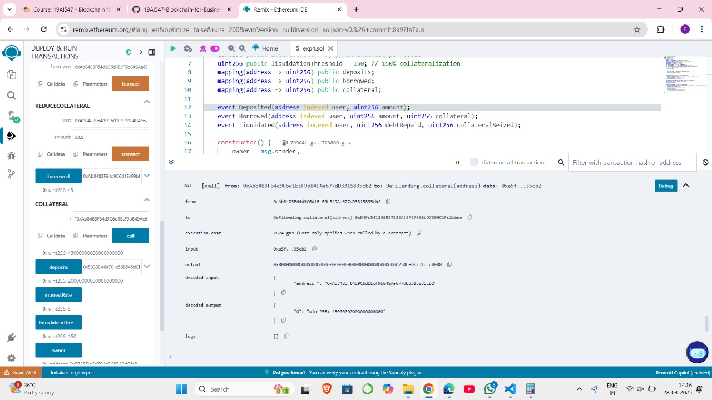
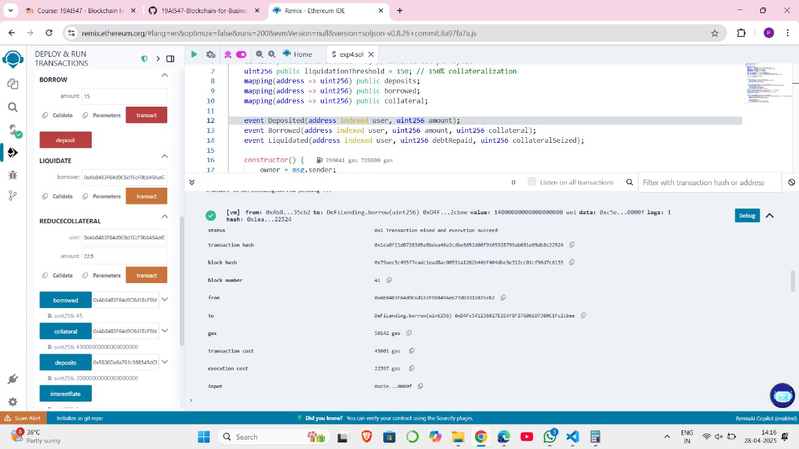
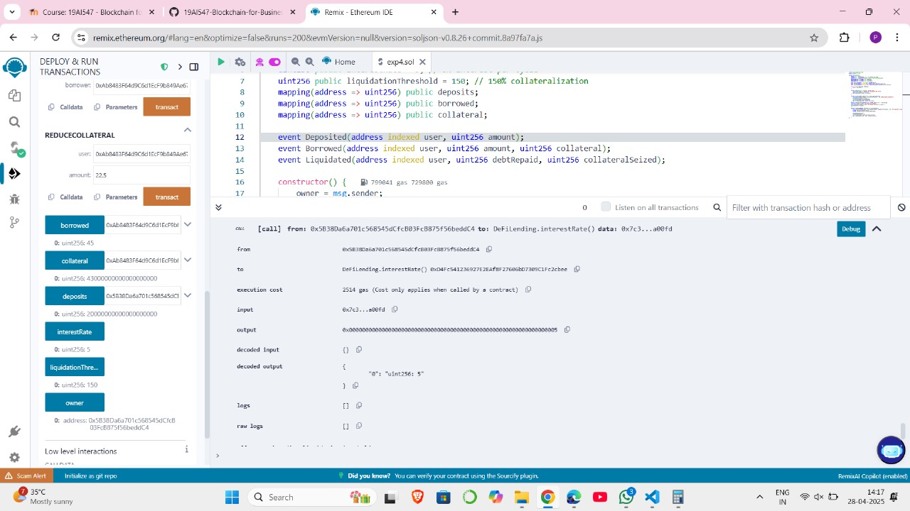
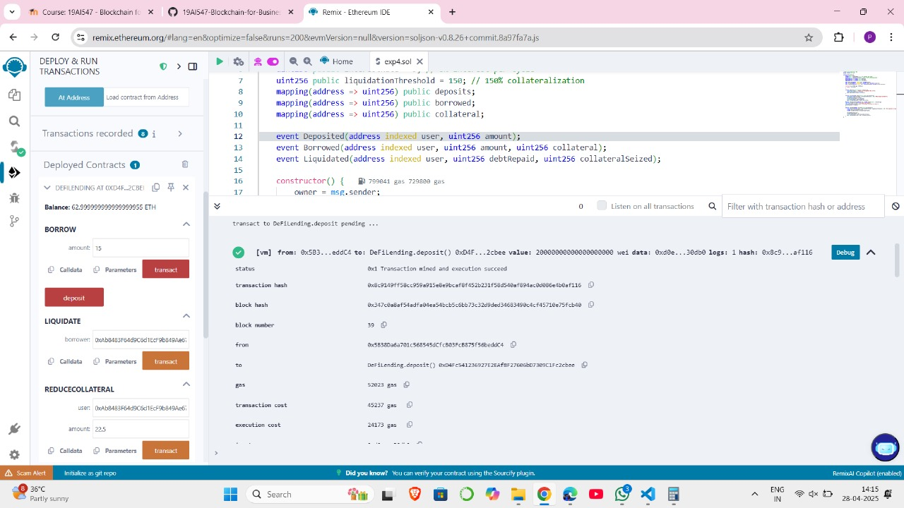
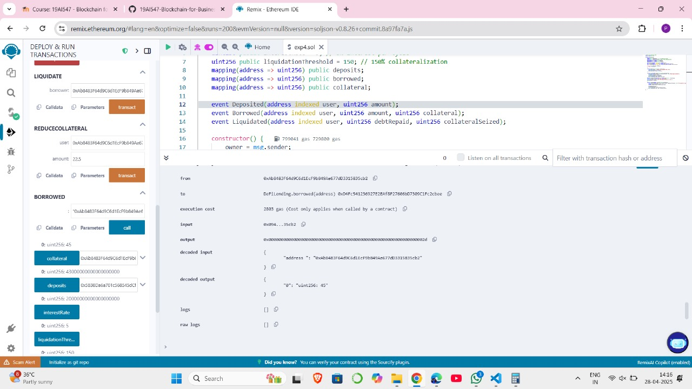
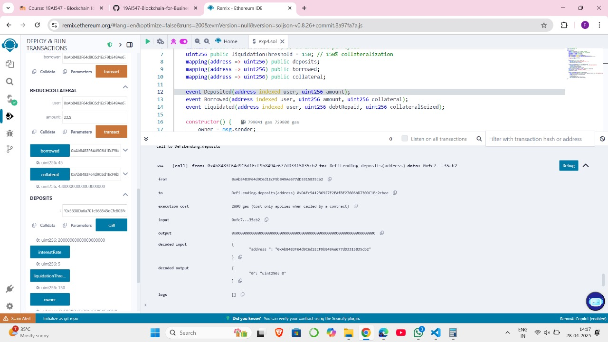
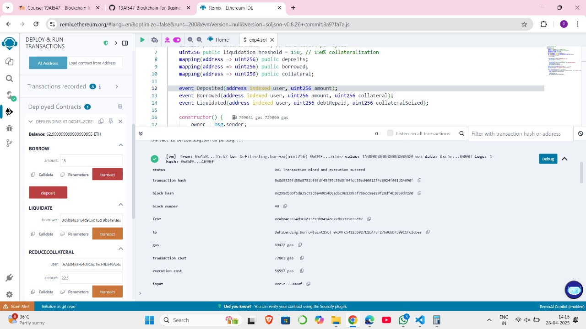
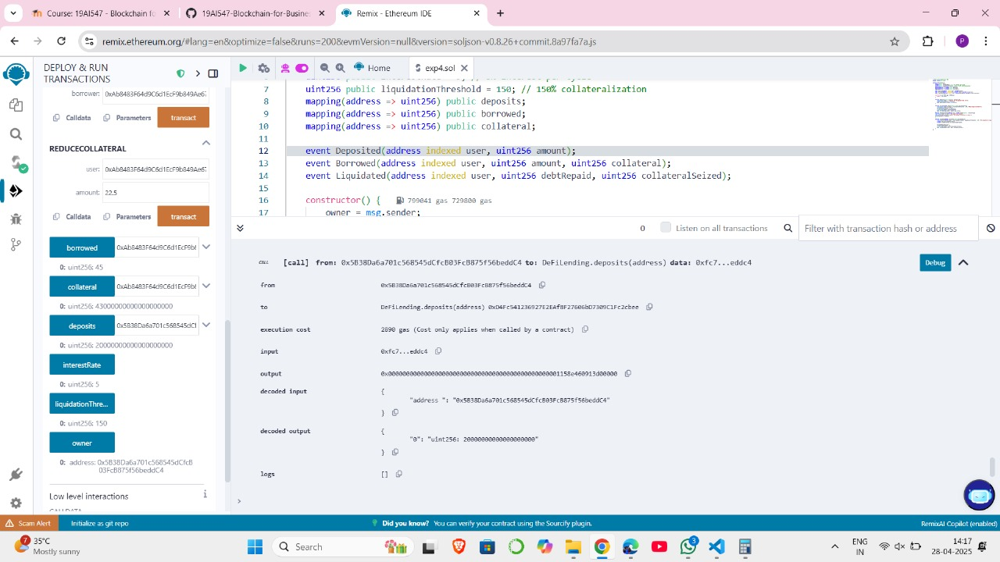

# Experiment 4: DeFi Lending and Borrowing Protocol
# Aim:
To build a decentralized lending protocol where users can deposit assets to earn interest and borrow assets by providing collateral. This experiment introduces concepts like overcollateralization, liquidity pools, and interest accrual in DeFi.

# Algorithm:

Step 1: Users deposit ETH into the smart contract to earn interest over time.

Step 2: Users can borrow ETH by providing enough collateral (at least 150% of the borrowed amount).

Step 3: The contract checks that collateral is sufficient before allowing the loan.

Step 4: Interest is calculated dynamically based on how much ETH is borrowed compared to total deposits.

Step 5: If a borrower’s collateral value drops below the safe level (liquidation threshold), they can be liquidated.

Step 6: Liquidators can repay a borrower's debt and claim their collateral to maintain system stability.

# Program:
#### Developed by: ARUN KUMAR B
#### Register number: 212223230021
#### Date: 28/04/2025

// SPDX-License-Identifier: MIT
pragma solidity ^0.8.20;

contract DeFiLending {
    address public owner;
    uint256 public interestRate = 5; // 5% interest per cycle
    uint256 public liquidationThreshold = 150; // 150% collateralization
    mapping(address => uint256) public deposits;
    mapping(address => uint256) public borrowed;
    mapping(address => uint256) public collateral;

    event Deposited(address indexed user, uint256 amount);
    event Borrowed(address indexed user, uint256 amount, uint256 collateral);
    event Liquidated(address indexed user, uint256 debtRepaid, uint256 collateralSeized);

    constructor() {
        owner = msg.sender;
    }

    function deposit() public payable {
        require(msg.value > 0, "Deposit must be greater than zero");
        deposits[msg.sender] += msg.value;
        emit Deposited(msg.sender, msg.value);
    }

    function borrow(uint256 amount) public payable {
        require(msg.value >= (amount * liquidationThreshold) / 100, "Not enough collateral");
        borrowed[msg.sender] += amount;
        collateral[msg.sender] += msg.value;
        payable(msg.sender).transfer(amount);
        emit Borrowed(msg.sender, amount, msg.value);
    }

    function liquidate(address borrower) public {
        require(collateral[borrower] < (borrowed[borrower] * liquidationThreshold) / 100, "Not eligible for liquidation");
        uint256 debt = borrowed[borrower];
        uint256 seizedCollateral = collateral[borrower];

        borrowed[borrower] = 0;
        collateral[borrower] = 0;
        payable(msg.sender).transfer(seizedCollateral);
        emit Liquidated(borrower, debt, seizedCollateral);
    }
}

# Output :

### Borrow

### Liquidate

### ReduceCollateral

### Borrowed

### Collateral

### Deposits

### Interest rate

### Liquidation threshold call

### Owner

# RESULT : 

Thus, to build a decentralized lending protocol where users can deposit assets to earn interest and borrow assets by providing collateral. This experiment introduces concepts like overcollateralization, liquidity pools, and interest accrual in DeFi is executed successfully.