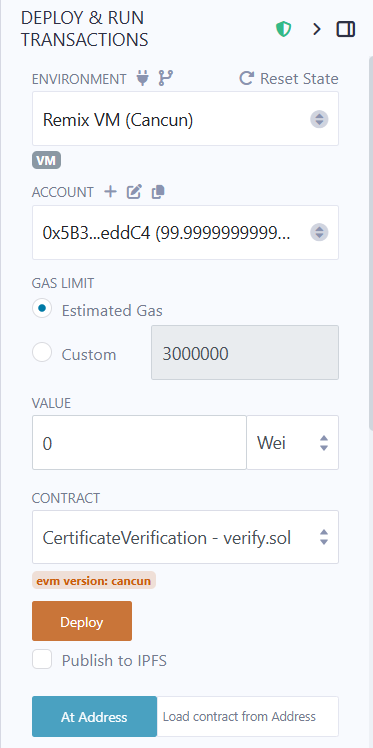
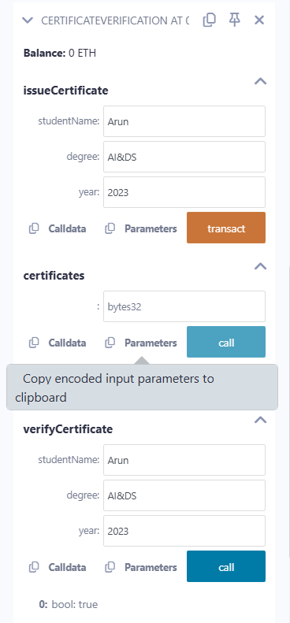

### Decentralized Certificate Verification

### AIM :

     To design and implement a Decentralized Certificate Verification System that ensures the authenticity, integrity, and tamper-proof storage of academic or professional certificates using blockchain technology, allowing third parties to verify certificates without relying on centralized authorities.

### ALGORITHM :

    1. Institution collects student/employee details and certificate data.
    2. Generate a unique hash of the certificate (using SHA-256 or similar).
    3. Store the actual certificate (PDF or metadata).
    4. Keep the full certificate off-chain and only store the hash on-chain.
    5. Recomputes the hash of the submitted certificate.
    6. Retrieves the original hash from the blockchain using certificate ID.
    7. Optionally, verify issuer’s signature using public key to confirm authenticity.

### PROGRAM :

## NAME:ARUN KUMAR B
## RES.NO:212223230021

```
// SPDX-License-Identifier: MIT
pragma solidity ^0.8.20;
contract CertificateVerification {
    address public university;
    mapping(bytes32 => bool) public certificates; // Store hashed certificates
    event CertificateIssued(bytes32  certHash);

    constructor() {

        university = msg.sender; // University deploys the contract
   }
   function issueCertificate(string memory studentName, string memory degree, uint256 year) public {
    require(msg.sender == university, "Only university can issue certificates");
    bytes32 certHash = keccak256(abi.encodePacked(studentName, degree, year)); 
    certificates[certHash] = true;
    emit CertificateIssued(certHash);
}
function verifyCertificate(string memory studentName, string memory degree, uint256 year) public view returns (bool) {
    bytes32 certHash = keccak256(abi.encodePacked(studentName, degree, year));
    return certificates[certHash];
    }
}
```
### OUTPUT :
 
   

   

   

### RESULT :

   The implementation of Decentralized Certificate Verification using blockchain or distributed ledger technology (DLT) achieves several significant outcomes. 
        